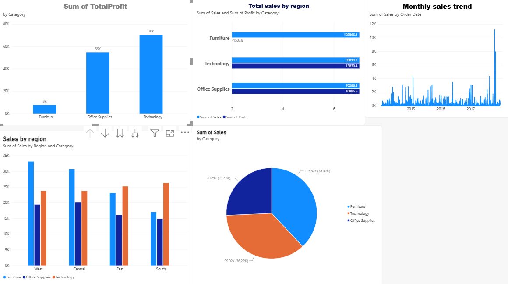

# Superstore Sales Performance Dashboard

## Project Overview

This project is a Power BI dashboard created using the Sample Superstore dataset.

The dashboard provides insights into sales, profit, regional performance, category performance, and monthly sales trends.

## Tools Used

- Power BI
- Power Query
- Sample Superstore Dataset

## Data Preparation

The following data preparation and transformation tasks were performed:

- Corrected data types
- Removed duplicate records
- Renamed Ship Mode to Shipping Mode
- Removed unnecessary columns
- Reordered columns
- Created Net Sales
- Created Order Size
- Created Profit Margin
- Created Discount Amount
- Grouped data by Category

## Dashboard Visualizations

The dashboard includes:

- Sales and Profit by Category
- Sales by Region
- Monthly Sales Trend
- Sales by Region and Category
- Sales Contribution by Category

## Skills Demonstrated

- Data Cleaning
- Data Transformation
- Power Query
- Data Visualization
- Dashboard Design
- Data Analysis

## Dashboard Preview

